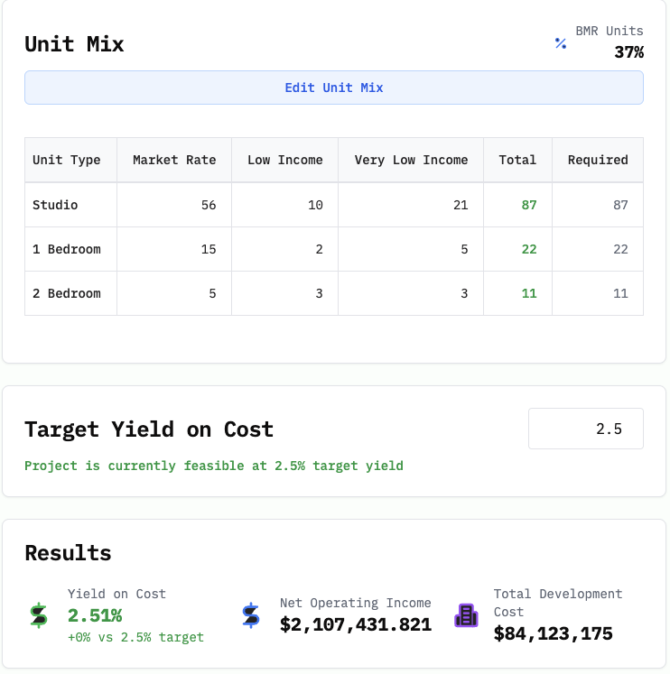

import FeasibilityCalculator from '../../components/custom/FeasibilityCalculator';

Everyone wants to talk about Social Housing, and for good reason! It can be a meaningful part of fixing our housing market and creating new affordable housing.

But the details matter, and some advocates are more focused on their ideological hobby horses than actually getting much of anything done. Ignore them. Social Housing can work - if you take it seriously.

__The tl;dr is that you need market rate units and normal BMR rents to make it work out. Skip down to the [feasability calculator](#development-feasibility-calculator) to try out a unit mix yourself.__

There are a lot of different definitions of Social Housing - mine is that it's housing that's built and operated by the state for the sake of the common good, rather than to maximize profits for investors. Foregone profits get funneled into lower rents for residents. In a for-profit model (which includes most "nonprofit" and "affordable" housing), housing is only built if investors think they can make enough money to justify the risk.

Two new reports out of San Francisco and Berkeley help us understand the trade-offs that policymakers need to make in order to build social housing.

As you might imagine, the major trade off is between taxpayer subsidies on the one hand and unit counts and rents on the other. The lower the rents, the more money taxpayers need to put in and the fewer units you're going to get. Higher rents mean lower subsidies and more units.

# San Francisco's Odd Report
In mid-December Dean Preston, the soon-to-be unemployed YIMBY bête noire out of San Francisco [posted](https://bsky.app/profile/deanpreston.bsky.social/post/3ldh2og5tzk27) about Social Housing, including a new report produced by SF's Budget and Legislative Analyst about ["Financial Feasability of Social Housing in San Francisco"](https://image.bos.sfgov.org/lib/fe3f15707564077d741374/m/1/6855a2a8-14ce-4fb3-ab29-19f13b43c88e.pdf). It's a bit of an odd duck - the report details some of the trade-offs necessary to get Social Housing built, and then steadfastly refuses to make them.

## What is feasibility anyway?
The key word in studies like this is "feasibility." You define some target like yield on cost on net income after debt service, then you take a look at rents and building costs and see if you can make the numbers work. If you can hit your target you call it "feasible" and you can't hit your target you call it "infeasible."

This is a common approach - The Terner Center ouf of UC Berkeley uses it for a great series called _Making It Pencil_ that looks out how private developments get built:
* [Making It Pencil: The Match Behind Housing Development](https://ternercenter.berkeley.edu/research-and-policy/making-it-pencil-2023/)
* [Making It Pencil: Can We Get Housing for Middle-Income Households To Work?](https://ternercenter.berkeley.edu/research-and-policy/middle-income-development-math/)
* [Making Missing Middle Pencil: The Match Behind Small-Scale Housing Development](https://ternercenter.berkeley.edu/research-and-policy/making-missing-middle-pencil-the-math-behind-small-scale-housing-development-2024/)

I'll probably write up these studies in a future post.

For SF's study, a development is considered feasible if it nets enough money from rents to cover any debt service - except when it assumes that taxpayer subsidies come in the form of explicit debt service, at which point it seems to be defined as feasible. (That's as opposed to implicit debt service subsidies, where the taxpayers provide low-interest loans. Every feasible scenario assumes these subsidies.)

## The Assumptions

There are a few assumptions that hobble their approach to what they're calling Social Housing:

### Rents are set very low
Units are categorized in the usual % of AMI buckets for BMR (below market rate) housing, but unlike traditional affordable housing, rents are set at a percent of tenant income. A very low percent of tenant income - 25%. It's true that traditional affordable housing is still quite expensive, and a tenant can remain technically rent-burdened despite living in a subsidized unit. The trade off here is just that the policies considered feasible required large and ongoing subisidies to pencil out, with city taxpayers assuming more than 100% of the cost of developing a building. A traditional BMR unit has higher rents and is also eligible for additional sources of funding, so the local contribution is more like 20-30% of the cost of development.

### Interest rates are set very low 
The report assumes that any feasible scenario requires a low-interest loan provided by city taxpayers, through a mechanism that does not yet exist. The report several times refers to these scenarios as "self-sustaining", which feels odd because even the scenarios where subsidies are counted as a lump sum up front, the taxpayers will still be paying on an ongoing basis, in the form of debt service for the local bonds that funded the public bank that funded the social housing development.

### Assumes zero land costs
Five of the six scenarios in the report assume that the city already owns the land it wants to build on, and so do not include land acquisition costs in their estimates of total development costs. The one scenario that does include those costs of course has higher per-unit and total subsidies 

### An unreasonable attachment to income-restricted units
The policies set out in SF's report make two assumptions:
* Every unit will be income restricted, with no one above 120% of AMI living in the buildings
* Tenants in the building will average no more than 80% of AMI.

In two separate places, the report describes why this is such an odd constraint:

> For all scenarios, we set the maximum at 120 percent of AMI because that was where we found rents started nearing market rate rents in San Francisco.

> [City] staff report that they have had challenges leasing deed-restricted affordable units to households earning close to 80% of AMI. According to [city] staff, households with incomes near 80 percent of AMI can often afford market rate apartments and choose market rate housing rather than deed-restricted affordable housing because it easier than going through the lengthy and time-consuming requirements of applying for deed-restricted affordable units.

(As an aside - another example of this I heard recently from an affordable housing developer, they said they had trouble leasing BMR studios that weren't guaranteed a parking space, which they were prohibited from providing to all units as a condition for one source of state funding.)

This is an example of activists trying to set policy without listening to the people the policy is ostensibly trying to help. They could reduce operational costs, reduce administrative burdens on tenants and bring in more money to help pay for the low-income units by simply allowing the market rate units that people at 80-120% are saying that they want.

### Assumes higher develoment and operating costs than traditional affordable housing
The report assumes that any social housing developments will have the same labor and workforce development requirements as other city projects which have prevailing wage, local business enterprise/small business enterprise, and local hire requirements. It also assumes that ongoing operations will be handled by city employees, who have higher wages and benefits than a privately administered project would. This is what's derisively referred to as an "everything bagel" policy, and sure you can do that, but it does result in higher costs, and thus fewer affordable units being built.

## Affordable housing, but make it Social-er
There's a lot of weird assumptions here but the one that gives away the game is scenario E, which provides a $430,000 up front subsidy to build the new buildings, but uses a commercial loan for the rest rather than a subsidized loan from the city. This is the one scenario they call infeasible. It's not the rents that are set far lower than traditional affordable housing, or the idea that there are no land acquisition costs, or the lack of any market rate housing that makes this scenario unfeasible. It's the simple fact that taxpayers aren't on the hook for every single penny of the development. That tells me all I need to know about the political purpose of this report.

My takeaway from this is that it's not really about building mixed income housing at any sort of scale - just another small, expensive program that scratches an activists' itch but doesn't do much.

The city's Housing Stability Fund is already mostly being spent on traditional affordable housing. These proposals will cost the city in the ballpark of $250,000 more per affordable unit, so the end result would be many fewer BMR units getting built. With rents set only to cover operational costs there's no income stream that can help build more buildings in the future.

The big differences here compared to traditional affordable housing are:
* Much lower rents
* Much greater contribution from taxpayers overall and city taxpayers in particular
* Somewhat higher development and operational costs

This just doesn't seem like a very sustainable way to build housing at any sort of scale to make an impact. Using the financing mechanisms suggested in the report, in ten years you'd get about 1,350 BMR units, a whopping 1.6% of SF's RHNA allocation for the current cycle - and at a much greater cost to city taxpayers than traditional affordable housing. In the context of RHNA, that's equivalent to Berkeley building 148 units of BMR housing.

At an up front, per-unit subsidy of $430,000, the city could provide an equivalent number of traditional BMR tenants with $1,500/month rent vouchers for the the better part of a century. That would actually cost taxpayers a lot less since they'd still be taking in property taxes and wouldn't have funded the low-interest loans.

# Berkeley's Feasability Study
The City of Berkeley recently commissioned a [similar analysis](https://berkeleyca.gov/sites/default/files/legislative-body-meeting-agendas/2024-12-02%20HAC%20Agenda_PACKET_Revised.pdf#page=27) - not of Social Housing, but of housing feasability in general. The goal here was not so much to advance an agenda but to honestly assess the impact of policy on building conditions.

It's pretty bleak! The topline is that under current conditions, nothing but student housing can get built. You'd need construction costs to come down (good) or rents to go up (bad) in order for anything to pencil. Now, student housing is great, it helps, but it's not enough.

In some ways, the report is too optimistic and in other ways it's too pessimistic. But it's all governed by a single assumption: That in order for a project to pencil, it needs to achieve a Yield-on-Cost of 6%. That means if you build a building for $1 million, it needs to net $60,000/year in rent or $5,000/month. The consultants looked at a fourplex that cost about $3.2 million to build, but only netted ~$10,500/month - not enough.

BUT! What if you relaxed that 6% assumption? What if the building was built by an entity that cared about housing the community and not returning cash to investors? It turns out that if you don't have to do that six, if you do say one or two percent, not only does a lot more housing pencil BUT it pencils with a lot below market rate units included in the mix.

##  Development Feasibility Calculator

To show you what I mean I built this small calculator that you can use to play with the target return and the unit mixes from Berkeley's study. Note that this doesn't capture every assumption and calculation that the consultants did, but it should give you an idea of what could be possible within the confines of this analysis. 

<FeasibilityCalculator client:only="react" />

For example...

### 8-Story Midrise
If you assume a 2.5% yield on cost, with the same development assumptions as the for-profit estimate, you can make a 120-unit building pencil at 37% BMR, with 2/3 of those being Very Low Income units, 

Note that I haven't changed any assumptions other than the necessary return - land costs, construction costs, even financing costs are all the same. So instead of assuming 3% loans from...some place...this project could go get a regular bank loan and pay regular bank interest.

# Less for More: The Challenge Of Public Subsidies

Both SF and Berkeley's studies imply one major hurdle for anyone who wants to advocate for social housing - under today's policy regime, cities are going to spend more money on social housing and get fewer affordable units, compared to traditional affordable housing. That's because even with all the hurdles and delays and expenses of traditional affordable housing, city money is mixed with private, state and federal money to get it built. But under current policy, it is difficult or impossible to use those sources for mixed-income housing.

## The need for state and regional funds

Anyone who wants to see social housing in the Bay Area as anything more than a vanity or pilot program needs to advocate that Sacramento change eligibility requirements, AND needs to advocate for the Bay Area Housing Finance Authority to guarantee that any funds made available from any future bond are made available to government-owned mixed income housing. Financing arrangements need to be flexible and responsive to the actual needs of cities trying to make mixed-income housing work.

San Francisco and Berkeley are both wealthy communities that can afford to build social housing on their own. There are also many, many other needs that taxpayers will be asked to cover in the coming decades. If we can augment local funds with existing state or new regional funds to finance social housing, it would make it a lot easier to get a lot more built.

# Next Steps - More Reports!

Two upcoming reports should give us more information on how this can get done:
1. The San Francisco Local Agency Formation Commission (LAFCO) is conducting a study analyzing the pros and cons of housing a social housing program in an existing City agency versus creating a brand-new agency
2. The city of Berkeley hired a [consultant](https://berkeleyca.gov/sites/default/files/documents/2023-09-12%20Item%2014%20Contract%20The%20Housing%20Workshop.pdf) to "to provide policy model research and market analysis to inform social housing initiatives for the Department of Health, Housing, and Community Services."

I'm looking forward to the results. Hopefully they will answer some of these questions and present more of path forward.