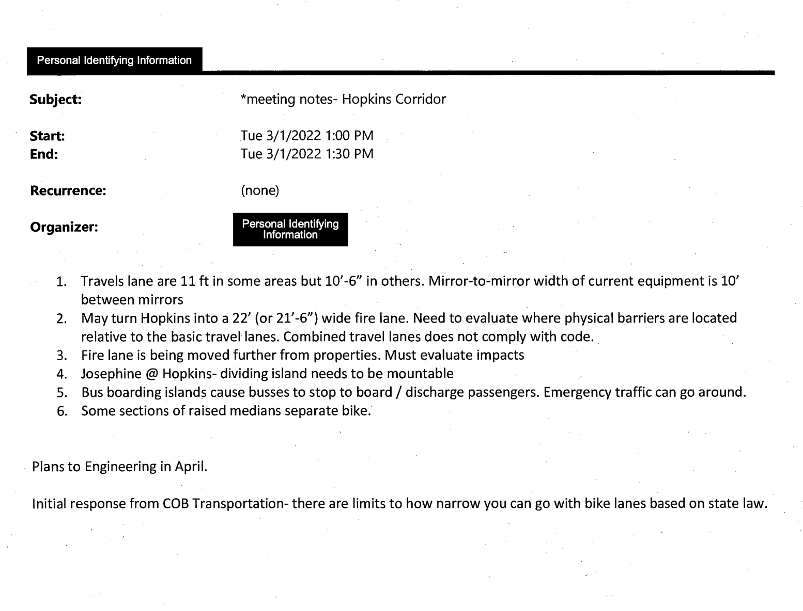
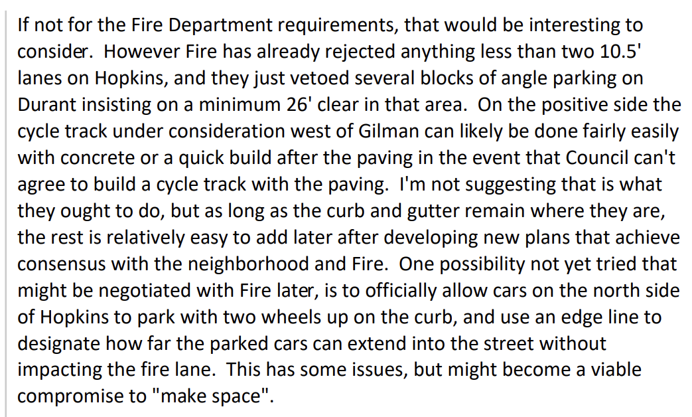

My introduction to local government was the very public, very messy process around the [bike lane plan on Hopkins street](https://berkeleyca.gov/your-government/our-work/capital-projects/hopkins-corridor-traffic-and-placemaking-study). And I'll admit - in the two years since the project was put on indefinite hold, I have not gotten over it.

In the last few months, I've done a pretty deep dive on the public record, reviewing hundreds of documents - emails, meeting notes, engineering reports, construction plans - trying to understand exactly what happened.[^1]

I'll have a lot more on this topic in the next few weeks, but in the meantime, I want to address a common misconception that people have, this idea that Farid Javandel, the former Deputy Director of Public Works for Transportation, and the rest of the staff at the transportation division, did not adequately include the Berkeley Fire Department in their planning process for Hopkins Street.

I don't believe this claim is supported by the public evidence. I'll share some of that evidence in this post and I'll say what I think it means.

# The Familiar Timeline

On January 23, 2018, Council approved a budget referral for a [“Hopkins Street Corridor Traffic and Placemaking Study”](https://berkeleyca.gov/sites/default/files/documents/Hopkins%20Corridor%20Study%20Referral%2001-23-18_0.pdf) on its consent calendar.

After that, staff and consultants spent several years designing the project and engaging with the community in a public process to solicit input and feedback. Hundreds of residents gave many hours of their lives over the course of at least seven evenings to that process, which took place primarily via videoconferencing due to the pandemic. The meetings spanned a period of over two years.

On May 10, 2022, Council approved the [Hopkins Corridor Project Conceptual Design](https://berkeleyca.gov/sites/default/files/2022-04/2022-05-10%20Item%2033%20Hopkins%20Corridor%20Project.pdf) by a vote of 8-1, and directed city staff to begin detailed engineering for the project.

Five months later, on October 11, 2022 Council discussed but did not approve an item [“Reconsideration of Hopkins Corridor Plan in Light of Newly Available Material Information”](https://berkeleyca.gov/sites/default/files/documents/2022-10-11%20Item%2023%20Reconsideration%20of%20Hopkins%20Corridor.pdf) and decided to order [more studies of the project and alternatives](https://berkeleyca.gov/sites/default/files/documents/2022-10-11%20Item%2023%20Rev2%20City%20Manager.pdf) (with the May 10 approval still in effect).

Finally on April 4, 2023, former City Manager Dee Williams-Ridley released a letter informing council and the public that [the project would be placed on an indefinite hold](https://berkeleyca.gov/sites/default/files/documents/2023-04-05%20Public%20Information%20for%20Hopkins%20Corridor%20Project.pdf) citing, among other things, compliance issues with respect to fire safety regulations.

# New Public Documents Dispel the Public Criticism

Before and especially after the Williams-Ridley letter, the Transportation staff came under repeated criticism by the public regarding emergency service and evacuation. But from the evidence I've seen, those critics are wrong.

## The Evidence

### Meeting Notes

On March 1, 2022, an employee of the Berkeley Fire Department [documented a meeting](https://hopkins-street-documents.s3.us-west-2.amazonaws.com/MtgNotes_SRiggs(BFD)_HopkinsCorridor_BThomas3-1-22.pdf-redacted+(2).pdf) they had with someone from the Transportation Division, regarding the Hopkins Corridor. Those notes documented issues and steps that Transportation would need to take. 

__My read:__ Transportation directly consulted BFD even during the conceptual phase, and IIRC they added a mountable curb across much of the narrow segment of the street - in compliance with BFD's request.

### Farid and BFD
On January 31, 2023, [Javandel described his divison's interactions with BFD](https://hopkins-street-documents.s3.us-west-2.amazonaws.com/Re_%2BHopkins%2BGilman%2Bto%2BNorthside%2Bquestion.pdf) in an email exchange with local activists, in response to a suggestion about Hopkins bike lanes.

__My read:__ Javandel is talking about "requirements", that BFD has "rejected" and "vetoed", that Transportation needs to "achieve consensus" and "negotiate" and find "a viable compromise". That sounds pretty professional and appropriate to me, and it does not sound like someone barreling ahead with no thought for the fire department.

### Fire Chief Says Process Is TBD

On Feburary 8, 2023, then-Interim Fire Chief David Sprague explained in an email [following up on a meeting with local activists](https://hopkins-street-documents.s3.us-west-2.amazonaws.com/RE_%2BThanks_Redacted%20Redacted.pdf) that the city did not at that time have an established process for how the fire department gives input on public works projects:

> My intention moving forward, along with [former Public Works Director Liam] Garland, is to clearly define a process within the city for how these projects interact with fire - this is in the works now.
>
> [...]
>
> In the coming months, I think our efforts will provide some clarity to the process, some baseline standards that projects will need to comply with, and some other tools we can use to help make decisions when project components fall in the grey area where stakeholders need to make decisions that will have an unavoidable trade off, one way or the other.

__My read:__  If BFD and Public Works were working to "clearly define a process" and hoping to "provide some clarity to the process" for collaboration, what exactly are critics accusing Javandel and his team of not doing? The city has been doing these kinds of projects, on evacuation routes, for many years. It doesn't feel reasonable to accuse people of not following procedures that don't exist.

## Wrapping Up: The Critics Are Wrong

The only conclusion I can draw from the evidence I have seen is that public works *did* adequately consult and respect the fire department, and that criticism to the contrary is misplaced.

Now I should note - when I say "criticsm", I'm talking about folks in the public, on social media, etc., who say that there was something amiss in the process with respect to fire. I'm not talking about other issues, and I'm not talking about the Williams-Ridley letter or any other blogs or reporting on the topic. (More to come on all of that later)

I understand that these documents haven't been released publicly before, so I don't blame people for believing what they've read. I do think that people should update their beliefs though, because as far as I can tell the city staff here were thorough professionals who were doing their best. It's not right to repeatedly accuse them of making mistakes that they didn't make.

[^1]: Most of these documents came from public records requests

